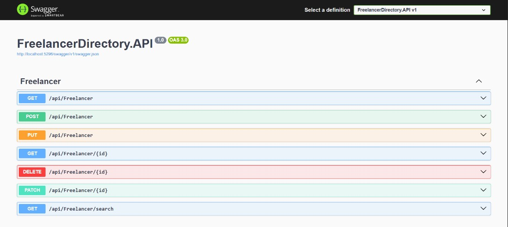
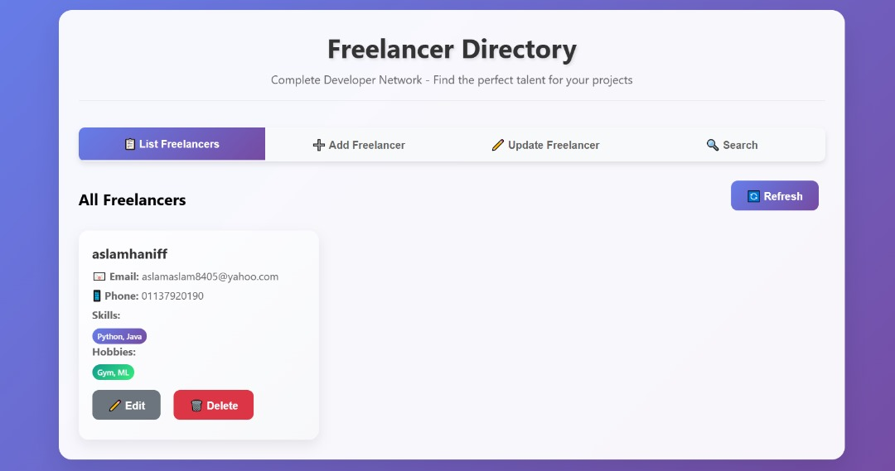
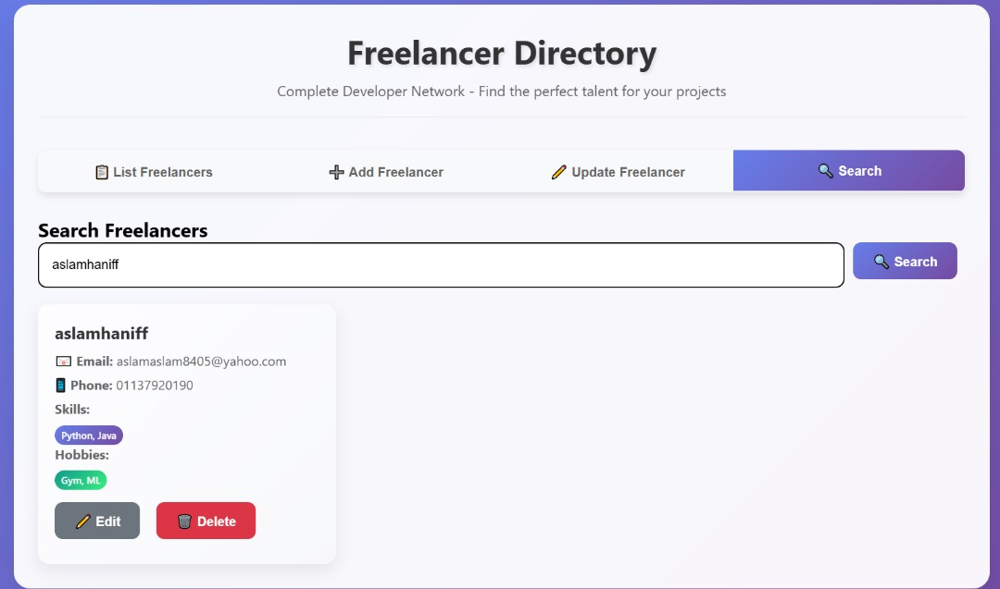

# Freelancer Directory - Complete Developer Network

[](https://dotnet.microsoft.com/)
[](https://asp.net/)
[](https://docs.microsoft.com/en-us/ef/)
[](https://www.microsoft.com/en-us/sql-server)
[](https://blog.cleancoder.com/uncle-bob/2012/08/13/the-clean-architecture.html)

A modern, full-stack freelancer directory application built with **Clean Architecture** principles, featuring a RESTful API backend and an elegant web interface.

## Table of Contents

- [Overview](#overview)
- [Features](#features)
- [Architecture](#architecture)
- [Technology Stack](#technology-stack)
- [Getting Started](#getting-started)
- [API Documentation](#api-documentation)
- [Project Structure](#project-structure)
- [Testing](#testing)
- [Screenshots](#screenshots)
- [Contributing](#contributing)

##  Overview

The Freelancer Directory is a comprehensive solution for managing freelancer profiles, designed for Complete Developer Network (CDN). It demonstrates modern software development practices with Clean Architecture, SOLID principles, and contemporary web technologies.

### Key Capabilities
- **Complete CRUD Operations** - Create, Read, Update, Delete freelancer profiles
- **Advanced Search** - Wildcard search across usernames and emails
- **Archive Management** - Archive/unarchive freelancer profiles
- **Professional UI** - Modern, responsive web interface
- **RESTful API** - Well-documented API following REST conventions
- **Clean Architecture** - Maintainable, testable, and scalable codebase

## Features

### Backend Features
- **RESTful API** with comprehensive CRUD operations
- **Clean Architecture** implementation with clear separation of concerns
- **Entity Framework Core** with SQL Server integration
- **Advanced Search** with wildcard pattern matching
- **CORS Support** for cross-origin requests
- **Swagger Documentation** for API exploration
- **Unit Testing** structure ready for comprehensive testing
- **Archive/Unarchive** functionality for soft deletes

### Frontend Features
- **Modern UI/UX** with glassmorphism design
- **Responsive Design** that works on all devices
- **Real-time API Integration** with error handling
- **Interactive Forms** with client-side validation
- **Search Functionality** with instant results
- **Professional Animations** and smooth transitions
- **User-friendly Notifications** for all operations

## Architecture

This project follows **Clean Architecture** principles with clear separation between:

```
┌─────────────────┐    ┌─────────────────┐
│   Presentation  │────│       API       │
│     Layer       │    │   Controllers   │
└─────────────────┘    └─────────────────┘
         │                       │
         ▼                       ▼
┌─────────────────┐    ┌─────────────────┐
│   Application   │────│  Infrastructure │
│     Layer       │    │     Layer       │
└─────────────────┘    └─────────────────┘
         │                       │
         ▼                       ▼
┌─────────────────┐    ┌─────────────────┐
│     Domain      │◄───│   Persistence   │
│     Layer       │    │   Repository    │
└─────────────────┘    └─────────────────┘
```

### Layer Responsibilities

- **Domain Layer**: Core business entities and logic
- **Application Layer**: Use cases and business rules coordination  
- **Infrastructure Layer**: Data access, external services, repositories
- **API Layer**: HTTP endpoints, request/response handling
- **UI Layer**: User interface and user experience

## Technology Stack

### Backend
- **Framework**: ASP.NET Core 8.0
- **Database**: SQL Server with Entity Framework Core
- **Architecture**: Clean Architecture with CQRS patterns
- **Documentation**: Swagger/OpenAPI 3.0
- **Testing**: xUnit with Moq
- **Serialization**: Newtonsoft.Json for PATCH operations

### Frontend
- **HTML5** with semantic markup
- **CSS3** with modern features (Grid, Flexbox, Custom Properties)
- **Vanilla JavaScript** (ES6+) for API integration
- **Responsive Design** with mobile-first approach
- **Modern UI Patterns** (Glassmorphism, Micro-interactions)

### Development Tools
- **IDE**: Visual Studio Code / Visual Studio 2022
- **Version Control**: Git with GitHub
- **API Testing**: Swagger UI, Postman-compatible
- **Live Development**: Live Server extension

## Getting Started

### Prerequisites

- **.NET 8.0 SDK** or later
- **SQL Server** (LocalDB/Express/Full)
- **Visual Studio Code** or **Visual Studio 2022**
- **Git** for version control

### Installation

1. **Clone the repository**
   ```bash
   git clone https://github.com/yourusername/freelancer-directory.git
   cd freelancer-directory
   ```

2. **Restore dependencies**
   ```bash
   dotnet restore
   ```

3. **Update database connection string**
   ```bash
   # Edit FreelancerDirectory.API/appsettings.json
   {
     "ConnectionStrings": {
       "DefaultConnection": "Server=(localdb)\\mssqllocaldb;Database=FreelancerDirectoryDb;Trusted_Connection=true;MultipleActiveResultSets=true"
     }
   }
   ```

4. **Create and migrate database**
   ```bash
   cd FreelancerDirectory.API
   dotnet ef database update
   ```

5. **Run the application**
   ```bash
   dotnet run
   ```

6. **Launch the UI**
   - Open `FreelancerDirectory.UI/index.html` with Live Server
   - Or serve with: `python -m http.server 8080`

### Quick Start URLs

- **API Swagger**: `http://localhost:5296/swagger`
- **Direct API**: `http://localhost:5296/api/freelancer`
- **Web UI**: `http://localhost:5500` (Live Server)

## API Documentation

### Base URL
```
http://localhost:5296/api/freelancer
```

### Endpoints

#### Freelancer Management

| Method | Endpoint | Description | Request Body |
|--------|----------|-------------|--------------|
| `GET` | `/` | Get all freelancers | - |
| `GET` | `/{id}` | Get freelancer by ID | - |
| `POST` | `/` | Create new freelancer | `FreelancerDto` |
| `PUT` | `/` | Update existing freelancer | `FreelancerDto` |
| `DELETE` | `/{id}` | Delete freelancer | - |
| `PATCH` | `/{id}` | Partial update freelancer | `JsonPatchDocument` |

#### Search & Filter

| Method | Endpoint | Description | Parameters |
|--------|----------|-------------|------------|
| `GET` | `/search` | Search freelancers | `?query=searchterm` |

### Data Models

#### FreelancerDto
```json
{
  "id": "guid",
  "username": "string",
  "email": "string",
  "phoneNumber": "string",
  "skillsets": ["string"],
  "hobbies": ["string"],
  "isArchived": "boolean",
  "createdAt": "datetime",
  "updatedAt": "datetime"
}
```

#### Sample Request
```bash
POST /api/freelancer
Content-Type: application/json

{
  "username": "johndoe",
  "email": "john@example.com",
  "phoneNumber": "123-456-7890",
  "skillsets": ["JavaScript", "React", "Node.js"],
  "hobbies": ["Photography", "Gaming"]
}
```

## Project Structure

```
FreelancerDirectory/
├── 📁 FreelancerDirectory.Domain/          # Core business entities
│   ├── Entities/
│   │   ├── Freelancer.cs
│   │   ├── Skillset.cs
│   │   └── Hobby.cs
│   └── FreelancerDirectory.Domain.csproj
│
├── 📁 FreelancerDirectory.Application/     # Business logic layer
│   ├── DTOs/
│   │   └── FreelancerDto.cs
│   ├── Interfaces/
│   │   └── IFreelancerRepository.cs
│   │   └── IFreelancerService.cs
│   │   └── IHobbyRepository.cs
│   │   └── ISkillsetRepository.cs
│   └── FreelancerDirectory.Application.csproj
│
├── 📁 FreelancerDirectory.Infrastructure/  # Data access layer
│   ├── Persistence/
│   │   ├── FreelancerDbContext.cs
│   ├── Repositories/
│   │   └── FreelancerRepository.cs
│   └── FreelancerDirectory.Infrastructure.csproj
│
├── 📁 FreelancerDirectory.API/             # Web API layer
│   ├── Controllers/
│   │   └── FreelancerController.cs
│   ├── Program.cs
│   ├── appsettings.json
│   └── FreelancerDirectory.API.csproj
│
├── 📁 FreelancerDirectory.Tests/           # Unit tests
│   ├── CustomWebApplicationFactory.cs
│   ├── UnitTestCreate.cs
│   ├── UnitTestSearch.cs
│   ├── UnitTestUpdate.cs
│   └── FreelancerDirectory.Tests.csproj
│
├── 📁 FreelancerDirectory.UI/              # Frontend interface
│   └── index.html
│
├── 📄 FreelancerDirectory.sln              # Solution file
├── 📄 README.md                            # This file
└── 📄 .gitignore                           # Git ignore rules
```

## Testing

### Running Unit Tests
```bash
cd FreelancerDirectory.Tests
dotnet test --logger "console;verbosity=detailed" --verbosity quiet --nologo
```

### Test Coverage
The project includes comprehensive integration tests for:
- **API endpoints** - Full HTTP request/response testing with WebApplicationFactory
- **CRUD operations** - Create, Search, and Update functionality validation
- **Database integration** - In-memory Entity Framework Core database testing
- **JSON serialization** - Request/response data validation and parsing
- **Status code verification** - HTTP response code testing (201, 200, 204)
- **End-to-end scenarios** - Complete application stack testing

### Sample Test Structure
```csharp
[Fact]
public async Task CreateFreelancer_ShouldReturnCreatedFreelancer()
{
    // Arrange
    var freelancer = new FreelancerDto
    {
        Username = "john_doe",
        Email = "john@example.com",
        PhoneNumber = "1234567890",
        Skillsets = new List<string> { "C#", "ASP.NET Core" },
        Hobbies = new List<string> { "Cycling", "Reading" }
    };

    // Act
    var response = await _httpClient.PostAsJsonAsync("/api/freelancer", freelancer);

    // Assert
    response.StatusCode.Should().Be(HttpStatusCode.Created);
    var createdFreelancer = await response.Content.ReadFromJsonAsync<FreelancerDto>();
    createdFreelancer.Username.Should().Be("john_doe");
}
```

## 📱 Screenshots

### API Documentation (Swagger)

*Comprehensive API documentation with interactive testing*

### Modern Web Interface

*Clean, modern dashboard with glassmorphism design*

### Search Functionality

*Fast, intuitive search with real-time results*

##  Key Features Demonstration

### 1. Clean Architecture Implementation
- **Dependency Inversion**: High-level modules don't depend on low-level modules
- **Separation of Concerns**: Each layer has a single responsibility
- **Testability**: Easy to unit test with dependency injection
- **Maintainability**: Changes in one layer don't affect others

### 2. Advanced Search Capabilities
```csharp
public async Task<List<FreelancerDto>> SearchAsync(string query)
{
    return await _context.Freelancers
        .Where(f => f.Username.Contains(query) || f.Email.Contains(query))
        .Include(f => f.Skillsets)
        .Include(f => f.Hobbies)
        .Select(f => MapToDto(f))
        .ToListAsync();
}
```

### 3. Modern Frontend Architecture
- **Vanilla JavaScript** for maximum compatibility
- **Modular design** with reusable components
- **Error handling** with user-friendly messages
- **Responsive design** using CSS Grid and Flexbox

### 4. Professional API Design
- **RESTful conventions** with proper HTTP methods
- **Consistent response formats** with appropriate status codes
- **CORS support** for cross-origin requests
- **Swagger documentation** for easy integration

## Security Considerations

- **Input validation** on both client and server side
- **SQL injection prevention** through Entity Framework parameterization
- **CORS configuration** to control cross-origin access
- **Data transfer objects (DTOs)** to control exposed data

## Deployment Options

### Local Development
- **IIS Express** for local testing
- **Kestrel** for development server
- **SQL Server LocalDB** for database

### Production Deployment
- **Azure App Service** for hosting
- **Azure SQL Database** for production database
- **GitHub Actions** for CI/CD pipeline
- **Docker containers** for containerized deployment

## Contributing

1. **Fork** the repository
2. **Create** a feature branch (`git checkout -b feature/amazing-feature`)
3. **Commit** your changes (`git commit -m 'Add some amazing feature'`)
4. **Push** to the branch (`git push origin feature/amazing-feature`)
5. **Open** a Pull Request

### Development Guidelines
- Follow **Clean Architecture** principles
- Write **unit tests** for new features
- Update **documentation** for API changes
- Use **conventional commits** for commit messages


## Acknowledgments

- **Clean Architecture** concept by Robert C. Martin
- **ASP.NET Core** team for the excellent framework
- **Entity Framework Core** team for robust ORM
- **ETIQA IT** for the inspiring assessment challenge

---

### Built with passion for clean code and modern architecture

**Developed by**: Aslam Osama Husainy bin Abdul Haniff  
**For**: ETIQA IT Developer Assessment  
**Date**: August 2025 

*This project demonstrates expertise in .NET development, Clean Architecture, modern web technologies, and professional software development practices.*
